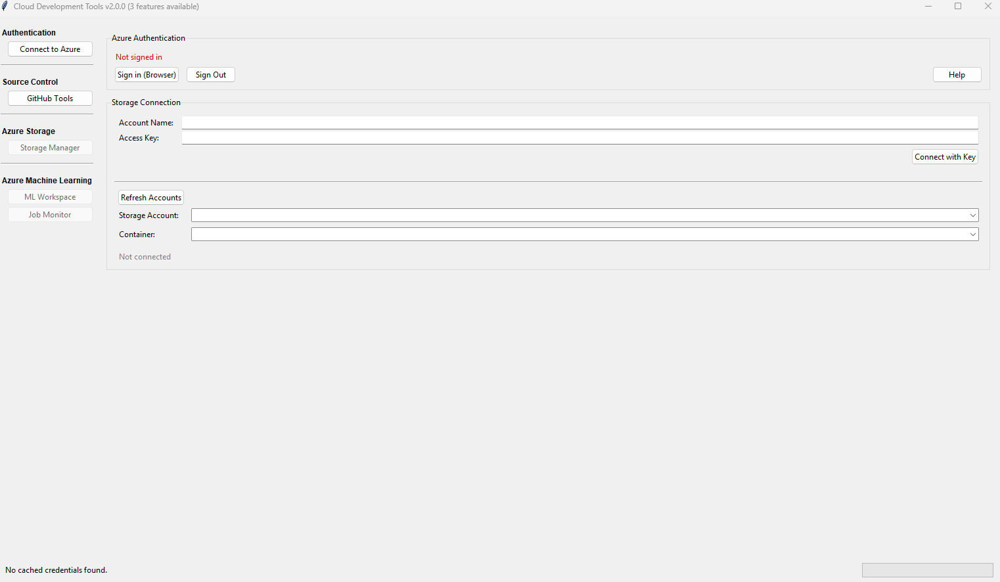

# Azure_Cloud_Send
The Unofficial Repo for Deploying Stuff to the Cloud

A previous version of thus repo behaved as a boilerplate start point for quickly deploying models to the cloud. In hindsight, I really should've deployed this with azurite as a proof of concept. 

A concern that may arise is that of one of the keys, the key left in the code is a public testing key that you'll find in Microsoft's documentation

Preview of the application:

The application allows you to login to github (provided git is installed on your machine), then login into azure via the web portal (instead of fishing out a key). 

The application lets you download a dataset from azure blob, choose the directory of your custom script/library (I've tested an "iteration" of this with GPU and CPU acceleration, and R, .Sh and Python3 libraries). 

The UX should scale between several monitors (the joys of once having a triple monitor setup) and several resolutions.

Installation:
Install UV: https://docs.astral.sh/uv/getting-started/installation/
Then run the command: uv init
The virtual environment should initialize
To get all the libraries simply type the following two commands:
uv add -r requirements.txt
uv sync

and Voila, a (hopefully) working azure cloud application

Now to run it simply type:
uv run main_cloud_app.py